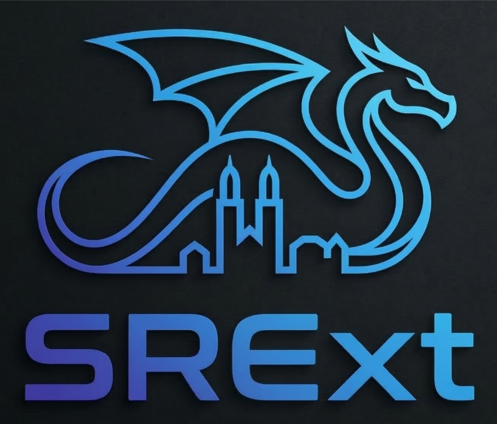

<p align="center">
  
</p>

# About

**The SRE Gemini CLI Extension** is a dedicated toolkit comprising specialized **Skills** designed to augment Site Reliability Engineers (SREs). By integrating deeply with the Gemini CLI, this extension empowers SREs to investigate outages, configure MCP servers, formulate mitigations, and detect anomalies more rapidly. See [a few PostMortems we've created](https://github.com/palladius/about-sre-extension/) with this tool.

## Installation

This extension supports both **Gemini CLI** (as Extension), and **Antigravity** + **Claude Code** + **Codex** (as Plugin).

For detailed installation instructions across all CLI environments, please refer to [INSTALL.md](INSTALL.md). 

Alternatively, if you have `just` installed, you can quickly set up the extension using our automated recipes:

```bash
# Google Antigravity CLI (agy)
just install-agy

# Google Gemini CLI (deprecated)
just install-geminicli

# Claude Code
just install-claude
```

This will allow you to easily manage it's lifecycle by easily updating the extension with `/extensions update --all`.


## Usage as a Plugin (Antigravity, Claude Code & OpenAI Codex)

This "SRE extension" can also be loaded directly as a plugin in **Antigravity**, **Claude Code**, and **OpenAI Codex** (and most plugin-supporting harnesses), sharing the same set of SRE skills.

### 1. Antigravity Setup

*   **Workspace-Level**: Place or symlink this repository folder inside `.agents/plugins/sre-extension/` or `_agents/plugins/sre-extension/` at the root of your workspace.
*   **Global-Level**: Place or symlink this repository folder inside `~/.gemini/config/plugins/sre-extension/`.

Antigravity will automatically recognize the root `plugin.json` manifest and load the SRE skills. For instance:

```bash
# This will install the SRE Extension _globally_ for Antigravity
mkdir -p ~/.gemini/config/plugins/
cd ~/.gemini/config/plugins/
git clone https://github.com/gemini-cli-extensions/sre sre-extension
```

### 2. Claude Code Setup

*   **Workspace-Level**: Place or symlink this repository folder inside `.claude/plugins/sre-extension/` at the root of your workspace.
*   **Global-Level**: Run Claude Code with the plugin directory flag: `claude --plugin-dir /path/to/sre-extension`

Claude Code will automatically recognize the `.claude-plugin/plugin.json` manifest and expose the skills under the `/sre-extension:` namespace.

### 3. OpenAI Codex Setup

*   **Workspace-Level / Manual Integration**: Place or symlink this repository folder inside `.codex-plugin/` or your configured plugin marketplace/custom project directory.

Codex will automatically recognize the `.codex-plugin/plugin.json` manifest and register the skills.


## Available Skills

### 🛠️ Core SRE Skills
- **`investigation-entrypoint`**: Primary entrypoint for investigating production outages, orchestrating SRE response, and mitigating incidents. Start here when an incident occurs!
- **`gcp-playbooks`**: Follows established SRE playbooks for GCP/GKE investigations, including infrastructure discovery and common mitigation steps.
- **`gcp-mcp-setup`**: Automates enabling services, Google Managed MCP (OneMCP) servers, generating API keys, and configuring `~/.gemini/settings.json`.
- **`gcp-slo-management`**: Discover Monitoring Services, list existing SLOs, or create new SLOs (Availability/Latency) via the REST API.
- **`postmortem-generator`**: Creates a generated PostMortem given enough context about a resolved incident/outage.

### ☁️ Cloud Capabilities
- **`cloud-build-investigation`**: Expert-level SRE skill for Google Cloud Build (GCB) and Cloud Run investigations. Correlates git commits with build failures and analyzes logs.
- **`cloud-logging`**: Skill for interacting with and analyzing Google Cloud Logging and Error Reporting. Processes large JSON logs or converts them to Apache format.
- **`cloud-monitoring`**: Interacts with Google Cloud Monitoring via APIs to avoid large context bloat. Exports time-series data and helps setup SLOs.

### 📊 Detection, Graphs & Mitigations
- **`generic-mitigations`**: Generic Mitigations high-level classification logic and actuation plan.
- **`monitoring-graphs`**: Generates high-quality, annotated incident graphs for post-mortems using Python to visualize outages and error rates (nice graphs visible [here](https://github.com/palladius/about-sre-extension/)).
- **`anomaly-detection`**: Detects anomalies in time-series data from various sources (Isolation Forest, KNN, Z-score).
- **`data-ingestion`**: Fetches and parses time-series data from various sources for downstream analysis.

## Quickstart

1. Install this extension by following the instructions in [INSTALL.md](INSTALL.md).
2. Only for the first time, use `gcp-mcp-setup` skill to setup your GCP project, and MCP servers:
   ```bash
   $ agy
   Use the gcp-mcp-setup skill to setup my GCP project "foo-bar-123" with email jane-doe-sre@credible-company.com 
   ```
2. Invoke the entrypoint skill with your incident request. For example:
   ```bash 
   $ agy
   Invoke the investigation entrypoint skill with this new incident: cluster gKE with ip 1.2.3.4 is reported down by numerous customers, please investigate.
   ```
3. The agent will take it from there—fetching context, querying metrics, and formulating mitigations.

For detailed instructions on setup and usage, please refer to the [User Manual](USER_MANUAL.md).


## Contributing

Check `CONTRIBUTING.md`.


## Feedback 

For feedback, please report **bugs** and **feature requests** in the issue tracker.
Any other intelligible feedback should be sent to this form: [SRE Extension Survey](https://forms.gle/eJPrbG4KKESp6GmF6)

# Thanks

Program Lead: [Riccardo](https://github.com/palladius)

Co-authors and contributors:
- [Madhavi](https://github.com/madkarra)
- [Ramón](https://github.com/rmedranollamas)
- [Szymon](https://github.com/szymonst)
<!-- add your name here -->
