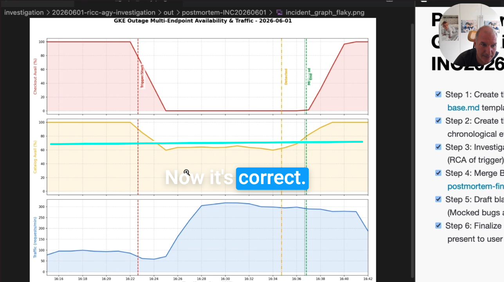

<p align="center">
  
</p>

> **Note:** Given the recent [deprecation of Gemini CLI](https://developers.googleblog.com/an-important-update-transitioning-gemini-cli-to-antigravity-cli/), this Extension is also fully functional as a Plugin for [agy CLI](https://antigravity.google), Claude Code, and Codex.


# About

**The SRE Gemini CLI Extension** is a dedicated toolkit comprising specialized **Skills** designed to augment Site Reliability Engineers (SREs). By integrating deeply with the Gemini CLI, this extension empowers SREs to investigate outages, configure MCP servers, formulate mitigations, and detect anomalies more rapidly.

See also:
* [Reference PostMortems](https://github.com/palladius/about-sre-extension/) we've created with this tool.
* [SRE Testing Suite](https://github.com/palladius/sre-testing-suite) to test your setups (currently a work in progress).
* [GKE Cluster Breakage Codelab](https://codelabs.developers.google.com/codelabs/investigate-gke-cluster-breakage-scenarios-with-postmortem#0) to practice outage investigation and postmortem scenarios.

## 📺 Demo Outage Investigation

Watch the **SRE Extension** in action as it performs a live production outage investigation and generates a detailed PostMortem:

[](https://youtu.be/bPCznsjW8BU)


## Installation

For detailed installation and configuration instructions across all CLI environments, please refer to the [Installation Guide (INSTALL.md)](INSTALL.md).

If you have [`just`](https://github.com/casey/just) (a modern `make` clone) installed, you can quickly set up the extension. If you don't have `just` yet, you can quickly install it via `brew install just` / 
`sudo apt-get install just` (or see [casey/just](https://github.com/casey/just#installation) for more options).

Once installed:

```bash
# Google Antigravity CLI (agy)
just install-agy
# Google Gemini CLI (deprecated)
just install-gemini
# Claude Code
just install-claude
```

You also need `python` and `uv` installed.


## Available Skills

### 🛠️ Core SRE Skills
- **`investigation-entrypoint`**: Primary entrypoint for investigating production outages, orchestrating SRE response, and mitigating incidents. Start here when an incident occurs!
- **`gcp-architecture-discovery`**: Discover and map GCP infrastructure architecture including compute, networking, storage, and service dependencies.
- **`gcp-playbooks`**: Follows established SRE playbooks for GCP/GKE investigations, including infrastructure discovery and common mitigation steps.
- **`gcp-mcp-setup`**: Automates enabling services, Google Managed MCP (OneMCP) servers, generating API keys, and configuring `~/.gemini/settings.json`.
- **`gcp-slo-management`**: Discover Monitoring Services, list existing SLOs, or create new SLOs (Availability/Latency) via the REST API.
- **`postmortem-generator`**: Creates a generated PostMortem given enough context about a resolved incident/outage.

### ☁️ Cloud Capabilities
- **`cloud-build-investigation`**: Expert-level SRE skill for Google Cloud Build (GCB) and Cloud Run investigations. Correlates git commits with build failures and analyzes logs.
- **`cloud-logging`**: Skill for interacting with and analyzing Google Cloud Logging and Error Reporting. Processes large JSON logs or converts them to Apache format.
- **`cloud-monitoring`**: Interacts with Google Cloud Monitoring via APIs to avoid large context bloat. Exports time-series data and helps setup SLOs.

### 📊 Detection, Graphs & Mitigations
- **`generic-mitigations`**: Generic Mitigations high-level classification logic and actuation plan.
- **`monitoring-graphs`**: Generates high-quality, annotated incident graphs for post-mortems using Python to visualize outages and error rates (nice graphs visible [here](https://github.com/palladius/about-sre-extension/)).
- **`anomaly-detection`**: Detects anomalies in time-series data from various sources (Isolation Forest, KNN, Z-score).
- **`data-ingestion`**: Fetches and parses time-series data from various sources for downstream analysis.

## Compatibility & Harness Support

| Capability            | Gemini CLI | Antigravity (`agy`)                                      | Claude Code                                              | Codex                                                    |
| :----------------------| :----------:| :--------------------------------------------------------:| :--------------------------------------------------------:| :--------------------------------------------------------:|
| **Type**              | Extension  | [Plugin](https://code.claude.com/docs/plugins/reference) | [Plugin](https://code.claude.com/docs/plugins/reference) | [Plugin](https://code.claude.com/docs/plugins/reference) |
| **Install**           | ✅          | ✅                                                        | ✅                                                        | 🟢                                                        |
| **MCP Setup**         | ✅          | ✅                                                        | 🟢                                                        | 🟢                                                        |
| **SRE Skills**        | ✅          | ✅                                                        | 🟢                                                        | 🟢                                                        |
| **GKE Investigation** | ✅          | ✅                                                        | 🟢                                                        | 🟢                                                        |

**Legend:** ✅ Works (Tested) | 🟢 Works (Untested) | 🔴 Doesn't Work (Red Flag)

## Quickstart

1. Install this extension by following the instructions in [INSTALL.md](INSTALL.md).
2. Only for the first time, use `gcp-setup` and `gcp-mcp-setup` skills to ensure your GCP project and MCP servers are set up correctly:
   ```bash
   $ agy
   /gcp-setup Setup my GCP project "foo-bar-123"
   with email `jane-doe-sre@credible-company.com`.
   [..]
   /gcp-mcp-setup Also set up MCP access to Cloud Logging,
   Cloud Monitoring, GKE and Documentation (Developer Knowledge). Skip
   BQ and Cloud Run for this time.
   ```
3. Invoke the entrypoint skill with your incident request. For example:
   ```bash 
   $ agy
   /investigation-entrypoint Use investigation entrypoint skill
   with this new incident: GKE cluster with frontend 1.2.3.4 is reported 
   down by numerous customers, please investigate.
   ```
4. The agent will take it from there—fetching context, querying metrics, and formulating mitigations.

For detailed instructions on setup and usage, please refer to the [User Manual](USER_MANUAL.md).


## Contributing

Check `CONTRIBUTING.md`.


## Feedback 

For feedback, please report **bugs** and **feature requests** in the issue tracker.
Any other intelligible feedback should be sent to this form: [SRE Extension Survey](https://forms.gle/eJPrbG4KKESp6GmF6)

# Thanks

Program Lead: [Riccardo](https://github.com/palladius)

Co-authors and contributors:
- [Madhavi](https://github.com/madkarra)
- [Ramón](https://github.com/rmedranollamas)
- [Szymon](https://github.com/szymonst)
<!-- add your name here -->
