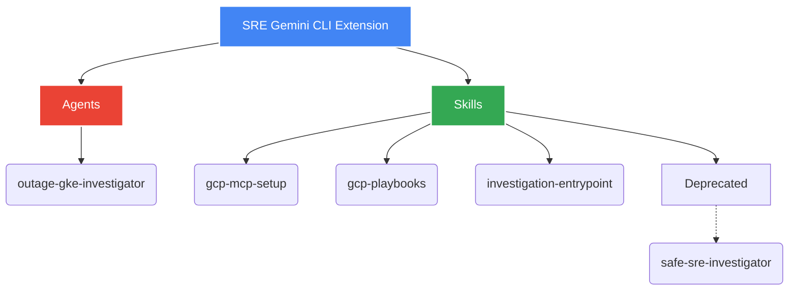

# SRE Gemini CLI Extension: User Manual

Welcome to the **SRE Gemini CLI Extension** user manual. This repository is an advanced toolkit providing curated **Skills** and **Agents** specifically designed to enhance the capabilities of SREs investigating incidents on Google Cloud Platform (GCP) through the Gemini CLI.

> [!NOTE]
> 🧪 **Experimental Status:** Please note that the Agents provided in this repository are currently experimental. They are meant to assist and accelerate reasoning but should not replace human verification.

## Available Skills

### `gcp-mcp-setup`

**Version:** 0.0.2 | **Status:** Beta

The `gcp-mcp-setup` skill automates the configuration of Google Managed MCP (OneMCP) servers, including Cloud Logging, Developer Knowledge, Firestore, and BigQuery. It streamlines the process of enabling APIs, managing service accounts, and generating the necessary API keys for seamless integration with the Gemini CLI.

**Key Features:**

*   **Automated Configuration:** Replaces multiple manual `gcloud` commands and console interactions with a single, reliable deployment script.
*   **Identity Sync:** Robust detection and resolution for discrepancies between the `gcloud` CLI identity and the Application Default Credentials (ADC) identity used by MCP servers, effectively preventing `403 Forbidden` errors.
*   **Seamless Integration:** Automatically updates your local or global Gemini CLI settings (`settings.json`) with the correct MCP endpoints.

#### Getting Started

1.  **Prerequisites:** 
    Ensure you have the `gcloud` CLI installed and authenticated (`gcloud auth login`) against a target GCP Project with billing enabled.
2.  **Setup:** 
    Run the setup script for your target project. You can choose to update the settings locally (`--local`) or globally (`--global`):
    ```bash
    python3 skills/gcp-mcp-setup/scripts/setup_onemcp.py YOUR_PROJECT_ID --local
    ```
3.  **Verification:** 
    Always run the verification script after setup to ensure health, connectivity, and identity consistency:
    ```bash
    python3 skills/gcp-mcp-setup/scripts/verify_setup.py
    ```

> [!TIP]
> **Resolving Identity Mismatches**: If verification fails due to an identity mismatch, run `gcloud auth application-default login --project=YOUR_PROJECT_ID` to resynchronize your ADC environment.

---

## Deprecated Skills

### `safe-sre-investigator`

> [!WARNING]
> **DEPRECATED:** The `safe-sre-investigator` skill is officially deprecated and is no longer recommended or supported for use. We are migrating to more robust, native open-source abstractions and localized SRE playbooks.

Previously designed to provide read-only `safe_gcloud` and `safe_kubectl` CLI wrappers during live incident investigations, it has been retired in favor of native safety controls and less obtrusive RBAC configurations within the GCP and GKE ecosystem.

## Component Architecture

Below is a brief overview of the different tools and agents provided within this extension:



