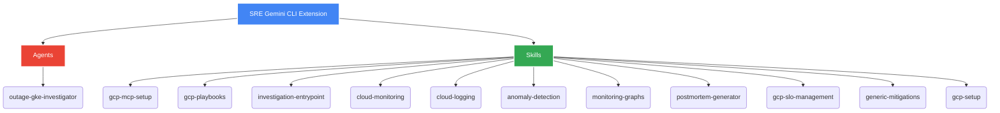

# SRE Gemini CLI Extension: User Manual

Welcome to the **SRE Gemini CLI Extension** user manual. This repository is an advanced toolkit providing curated **Skills** and **Agents** specifically designed to enhance the capabilities of SREs investigating incidents on Google Cloud Platform (GCP) through the Gemini CLI.

> [!NOTE]
> 🧪 **Experimental Status:** Please note that the Agents provided in this repository are currently experimental. They are meant to assist and accelerate reasoning but should not replace human verification.

## Loading as a Plugin (Antigravity, Claude Code & OpenAI Codex)

You can load this extension directly as a plugin in **Antigravity**, **Claude Code**, and **OpenAI Codex**.

### Antigravity Integration
To load the extension in Antigravity, place or symlink the repository folder inside one of these directories:
*   **Workspace-Level**: Place in `.agents/plugins/sre-extension/` (active only for the current workspace).
*   **Global-Level**: Place in `~/.gemini/config/plugins/sre-extension/` (active across all workspaces).

Antigravity will automatically discover the `plugin.json` manifest file at the root of the directory and expose all SRE skills, guidelines, and rules.

### Claude Code Integration
To load the extension in Claude Code:
*   **Workspace-Level**: Place or symlink the repository folder inside `.claude/plugins/sre-extension/` at the root of your workspace.
*   **Global-Level**: Run the `claude` command with the plugin directory flag:
    ```bash
    claude --plugin-dir /path/to/sre-extension
    ```

Claude Code will automatically discover the `.claude-plugin/plugin.json` manifest and expose all skills under the `/sre-extension:` namespace.

### OpenAI Codex Integration
To load the extension in Codex:
*   **Workspace-Level / Manual Integration**: Place or symlink the repository folder inside `.codex-plugin/` at the root of your workspace or custom plugin marketplace directory.

Codex will automatically discover the `.codex-plugin/plugin.json` manifest file at the root of the directory and register all SRE skills.

## Available Skills

### `gcp-mcp-setup`

**Version:** 0.0.2 | **Status:** Beta

The `gcp-mcp-setup` skill automates the configuration of Google Managed MCP (OneMCP) servers, including Cloud Logging, Developer Knowledge, Firestore, and BigQuery. It streamlines the process of enabling APIs, managing service accounts, and generating the necessary API keys for seamless integration with the Gemini CLI.

**Key Features:**

*   **Automated Configuration:** Replaces multiple manual `gcloud` commands and console interactions with a single, reliable deployment script.
*   **Identity Sync:** Robust detection and resolution for discrepancies between the `gcloud` CLI identity and the Application Default Credentials (ADC) identity used by MCP servers, effectively preventing `403 Forbidden` errors.
*   **Seamless Integration:** Automatically updates your local or global Gemini CLI settings (`settings.json`) with the correct MCP endpoints.

#### Getting Started

1.  **Prerequisites:** 
    Ensure you have the `gcloud` CLI installed and authenticated (`gcloud auth login`) against a target GCP Project with billing enabled.
2.  **Setup:** 
    Run the setup script for your target project. You can choose to update the settings locally (`--local`) or globally (`--global`):
    ```bash
    python3 skills/gcp-mcp-setup/scripts/setup_onemcp.py YOUR_PROJECT_ID --local
    ```
3.  **Verification:** 
    Always run the verification script after setup to ensure health, connectivity, and identity consistency:
    ```bash
    python3 skills/gcp-mcp-setup/scripts/verify_setup.py
    ```

> [!TIP]
> **Resolving Identity Mismatches**: If verification fails due to an identity mismatch, run `gcloud auth application-default login --project=YOUR_PROJECT_ID` to resynchronize your ADC environment.

---

### `investigation-entrypoint`

**Status:** Active

The primary entrypoint for investigating production outages. It orchestrates the SRE response by gathering context, collecting data via other skills, and formulating mitigation strategies.

**Key Features:**
* **Context Gathering:** Automatically identifies target projects, regions, and services involved.
* **Orchestration:** Delegates to `anomaly-detection`, `cloud-logging`, and `cloud-monitoring` for deep dives.
* **Risk Assessment:** Provides verbose risk assessments (🟢 LOW, 🟡 MEDIUM, 🔴 HIGH) for suggested actions.

---

### `gcp-playbooks`

**Status:** Beta

Provides established SRE playbooks for GCP/GKE investigations, mapping generic SRE concepts to specific GCP actions.

**Key Features:**
* **Infrastructure Discovery:** Systematic identification of resources.
* **Service-Specific Mitigations:** Tailored playbooks for Cloud Run (`run.md`) and GKE (`container.md`).
* **Deterministic Naming:** Playbooks are named after the GCP API service (e.g., `run.googleapis.com`).

---

### `cloud-monitoring` & `cloud-logging`

**Status:** Active

Specialized skills for interacting with Google Cloud Monitoring and Logging APIs while avoiding context bloat.

**Key Features:**
* **Efficient Extraction:** Uses export scripts to surface time-series data as CSV with metadata headers.
* **Visual Feedback:** Generates text-based "gists" of graph shapes (e.g., `█▇▆▇ ▂▃`) for immediate visual context.
* **Token Efficiency:** Converts large JSON logs to Apache format for better LLM processing.

---

### `anomaly-detection`

**Status:** Active

Detects anomalies in time-series data using various algorithms like Isolation Forest, KNN, and Z-Score.

**Key Features:**
* **Automated Preprocessing:** Autonomously decides on smoothing (Moving Average/Exponential) based on noise heuristics.
* **Self-Reflection:** Evaluates noise levels and automatically re-tunes parameters if results are too noisy.
* **Visual Output:** Generates annotated plots of detected anomalies.

---

### `monitoring-graphs`

**Status:** Active

Generates high-quality, annotated incident graphs for post-mortems using Python.

**Key Features:**
* **Milestone Annotation:** Automatically highlights incident start, detection, mitigation, and end points.
* **Data Integrity:** Ensures graphs use real data (no "AI hallucinations" of metrics).
* **Correlation Support:** Creates dual-axis graphs to correlate different signals (e.g., traffic vs. error rate).

---

### `postmortem-generator`

**Status:** Active

Automates the creation of comprehensive PostMortem documents in Markdown and Google Docs format.

**Key Features:**
* **Timeline Consolidation:** Merges events from multiple sources into a standardized CSV timeline.
* **Bug Integration:** Supports filing action items as bugs via `gh` CLI or other tools.
* **Standardized Template:** Follows SRE best practices for executive summaries, root cause analysis, and lessons learned.

---

### `postmortem-aggregator`

**Status:** Beta

Aggregates and crunches data from multiple PostMortem files to identify recurring patterns and organizational statistics.

**Key Features:**
* **Trend Analysis:** Calculates Time to Detect (TTD) and Time to Mitigate (TTM) across multiple incidents.
* **Pattern Recognition:** Identifies recurring root cause classes (e.g., HUMAN_ERROR, CONFIG_CHANGE).
* **Statistical Reporting:** Generates `pomo_stats.csv` and summary tables by year and product area.

---

### `gcp-slo-management`

**Status:** Active

Enables the discovery and management of Service Level Objectives (SLOs) in Google Cloud Monitoring.

**Key Features:**
* **Service Discovery:** Automatically identifies Monitoring Services within a GCP project.
* **SLO Creation:** Facilitates creating Availability and Latency SLOs via REST API calls.
* **Basic SLI Support:** Simplifies the definition of 99.9% availability targets.

---

### `gcp-setup`

**Status:** Active

Initial Google Cloud environment verification and identity harmonization.

**Key Features:**
* **Identity Sync:** Verifies consistency across `gcloud`, ADC, and `kubectl` identities.
* **Automated Fixes:** Provides one-click commands to log in or switch contexts if identities mismatch.
* **Safe Mode Integration:** Automatically triggers safety protocols if `SAFE_MODE` is enabled.

---

## Component Architecture

Below is a brief overview of the different tools and agents provided within this extension:



