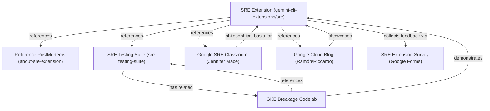

# Public SRE Resources Mind Map

This document visualizes the relationships between the public SRE Extension resources, testing tools, and learning materials.

## Mermaid Diagram

## Description of Mappings

| Source Resource | Relationship (Verb) | Target Resource | Notes |
| :--- | :--- | :--- | :--- |
| **SRE Extension** | references | **Reference PostMortems** | Provides real-world examples generated by the extension. |
| **SRE Extension** | references | **SRE Testing Suite** | Links to tools designed for verification and test setup. |
| **SRE Extension** | collects feedback via | **SRE Extension Survey** | Google Form for user feedback. |
| **SRE Extension** | references | **Google SRE Classroom** | Jennifer Mace's article forms the basis of the `generic-mitigations` philosophy. |
| **SRE Extension** | references | **Google Cloud Blog** | The blog post showcases a real outage solved using this extension. |
| **SRE Testing Suite** | has related | **GKE Breakage Codelab** | Hands-on tutorial guiding users through cluster breakage scenarios. |
| **GKE Breakage Codelab** | references | **SRE Testing Suite** | Uses the testing suite to set up broken clusters. |
| **GKE Breakage Codelab** | demonstrates | **SRE Extension** | Guides the user in executing outage investigations via the extension. |
