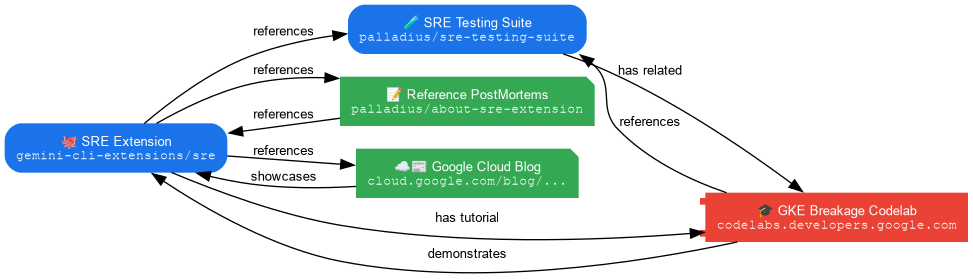
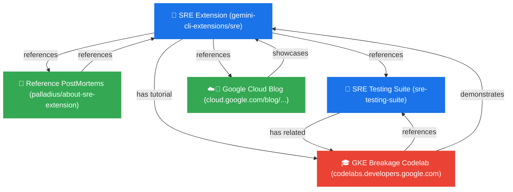

# Public SRE Resources Mind Map

This document visualizes the relationships between the public SRE Extension resources, testing tools, and learning materials, categorized into three distinct types:

*   **🐙 Code (Repositories)**: The core codebase and test infrastructure.
*   **📝 Articles & Docs**: PostMortems, reports, and informational articles.
*   **🎓 Codelabs**: Structured step-by-step learning tutorials.

## Compiled Graph Image

## Mermaid Diagram

## Description of Mappings

| Source Resource | Relationship (Verb) | Target Resource | Notes |
| :--- | :--- | :--- | :--- |
| **🐙 SRE Extension** | references | **📝 Reference PostMortems** | Provides real-world examples generated by the extension. |
| **🐙 SRE Extension** | references | **🧪 SRE Testing Suite** | Links to tools designed for verification and test setup. |
| **🐙 SRE Extension** | has tutorial | **🎓 GKE Breakage Codelab** | Hands-on tutorial guiding users through cluster breakage scenarios. |
| **🐙 SRE Extension** | references | **☁️📰 Google Cloud Blog** | The blog post showcases a real outage solved using this extension. |
| **📝 Reference PostMortems** | references | **🐙 SRE Extension** | PostMortems are created using and referencing the extension. |
| **🧪 SRE Testing Suite** | has related | **🎓 GKE Breakage Codelab** | Hands-on tutorial guiding users through cluster breakage scenarios. |
| **🎓 GKE Breakage Codelab** | references | **🧪 SRE Testing Suite** | Uses the testing suite to set up broken clusters. |
| **🎓 GKE Breakage Codelab** | demonstrates | **🐙 SRE Extension** | Guides the user in executing outage investigations via the extension. |
| **☁️📰 Google Cloud Blog** | showcases | **🐙 SRE Extension** | Demonstrates the SRE extension in action for incident response. |
